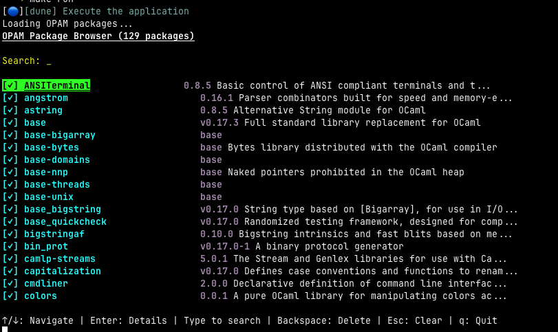

# OpamUI

A Terminal User Interface (TUI) for browsing and searching OCaml OPAM packages.



## Features

- 🖥️ **Browse Packages**: Terminal-based UI to view all available OPAM packages in your repository
- 🔍 **Search**: Type to filter packages by name in real-time
- ✅ **Installed Status**: Quickly see which packages are already installed
- 🧭 **Navigation**: Use arrow keys to navigate through the package list
- 📜 **Scrolling**: Automatic scrolling for large package lists
- 📋 **Package Details**: Press Enter to view detailed information about any package

## Prerequisites

- OCaml >= 4.08
- Dune >= 3.20
- OPAM package manager

## Key Bindings

| Key                  | Action                                  |
| -------------------- | --------------------------------------- |
| `↑` / `↓`            | Navigate up/down through packages       |
| `Enter`              | View package details / Return to list   |
| `Type`               | Search/filter packages by name          |
| `Backspace`          | Delete last character OR return to list |
| `Esc`                | Clear search OR return to list          |
| `q` / `Q` / `Ctrl+C` | Quit the application                    |

## Future Enhancements

Potential features to add:

- [x] Package details view (press Enter on a package) ✨
- [ ] Install/remove packages directly from TUI
- [ ] Multiple column layout
- [ ] Sort options (name, installed, version)
- [ ] Show package dependencies
- [ ] Show package authors and maintainers
- [ ] Export filtered list
- [ ] Configuration file support
- [ ] Mouse support (Notty supports it!)

## SLSA

All _artifacts_ provided by this repository meet [SLSA L3](https://slsa.dev/spec/v1.0/levels#build-l3)

### Verify SLSA provenance

Using the [Github CLI]():

```shell
$ gh attestation verify --owner nlamirault ~/Downloads/opamui-v0.2.0-macos-arm64
Loaded digest sha256:eeb4cd5274ed66748e56424276cea270d6a2e84805e7543fb09943339585d537 for file:///Users/nicolas.lamirault/Downloads/opamui-v0.2.0-macos-arm64
Loaded 1 attestation from GitHub API

The following policy criteria will be enforced:
- Predicate type must match:................ https://slsa.dev/provenance/v1
- Source Repository Owner URI must match:... https://github.com/nlamirault
- Subject Alternative Name must match regex: (?i)^https://github.com/nlamirault/
- OIDC Issuer must match:................... https://token.actions.githubusercontent.com

✓ Verification succeeded!

The following 1 attestation matched the policy criteria

- Attestation #1
  - Build repo:..... nlamirault/opamui
  - Build workflow:. .github/workflows/release-artifacts.yml@refs/tags/v0.2.0
  - Signer repo:.... nlamirault/opamui
  - Signer workflow: .github/workflows/release-artifacts.yml@refs/tags/v0.2.0
```

## SBOM

You could use [trivy](https://trivy.dev) to read SBOM file:

```shell
$ trivy sbom ~/Downloads/opamui-v0.2.0-macos-arm64.spdx.json
2025-11-14T09:35:53+01:00       INFO    [vuln] Vulnerability scanning is enabled
2025-11-14T09:35:53+01:00       INFO    Detected SBOM format    format="spdx-json"
2025-11-14T09:35:53+01:00       INFO    Number of language-specific files       num=0
```

or [Grype](https://github.com/anchore/grype):

```shell
$ grype sbom:~/Downloads/opamui-v0.2.0-macos-arm64.spdx.json
 ✔ Vulnerability DB                [rehydrated]
 ✔ Scanned for vulnerabilities     [0 vulnerability matches]
   ├── by severity: 0 critical, 0 high, 0 medium, 0 low, 0 negligible
No vulnerabilities found
```

## Contributing

See [CONTRIBUTING](CONTRIBUTING.md) file for details

## License

See [LICENSE](LICENSE) file for details.
